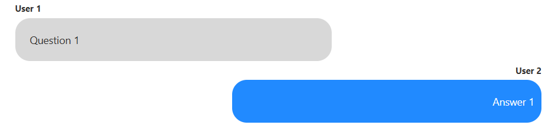
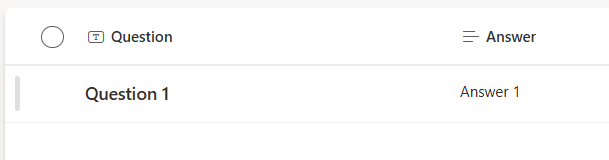

# Text Message

## Overview
This sample shows you how you can format a SharePoint list to make it look like a text conversation

## Use Case
- Portray conversation between two people
- FAQs or Help Page to show user's questions and support's answer

## SharePoint List Requirements

|Column Type               |Column Name|Required|
|-------------------|-------------|:------:|
|Single line of text  |Question  |Yes     |
|Multi Line Text (Plain text)  |Answer  |Yes     |

## Change Logs

Version |Date              |Comments
--------|------------------|--------------------------------
1.0     |April 26, 2025 |Initial release

## Disclaimer
**THIS CODE IS PROVIDED *AS IS* WITHOUT WARRANTY OF ANY KIND, EITHER EXPRESS OR IMPLIED, INCLUDING ANY IMPLIED WARRANTIES OF FITNESS FOR A PARTICULAR PURPOSE, MERCHANTABILITY, OR NON-INFRINGEMENT.**
